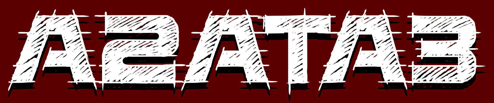

***
>ArmA2 Anims To ArmA3 (A2ATA3) - mod for ArmA3 that changes the most part of movement animations in A3 to A2 animations.
>>Warning: This mod is in development, so if you notice any problems just let me know :)

#### Links to mod:
>- [Steam Workshop](https://steamcommunity.com/sharedfiles/filedetails/?id=1199493544)
>- [Armaholic page](http://www.armaholic.com/page.php?id=33506)

#### Contact Links:
>- [Reddit](https://www.reddit.com/user/maximilionus/)
>- [Twitter](https://twitter.com/maximilionus)
>- [BI Forums](https://forums.bohemia.net/profile/1139060-maximilionus/)
>- [Armaholic](http://www.armaholic.com/users.php?m=details&id=92552&u=maximilionus)
>- [Steam](http://steamcommunity.com/profiles/76561198050952156)
